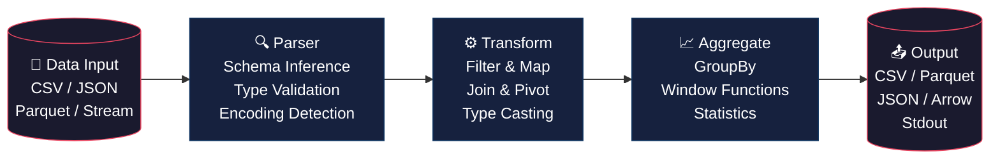

# 🦀 Rust Data Processing Engine

<div align="center">


[](Dockerfile)

</div>

---

# 🇧🇷 Engine de Processamento de Dados | 🇺🇸 Data Processing Engine

---

## 🇧🇷 Português

### 📊 Descrição

Engine de alta performance construída em Rust para processamento de grandes volumes de dados. Combina a velocidade e segurança de memória do Rust com a expressividade do Polars (DataFrame library) e a concorrência assíncrona do Tokio. O projeto demonstra como construir pipelines de dados robustos, tipados em tempo de compilação e livres de condições de corrida.

O engine suporta múltiplos formatos de entrada (CSV, JSON, Parquet), aplica transformações configuráveis e exporta resultados agregados com desempenho próximo ao nível de hardware.

### 🏗️ Arquitetura do Pipeline



### 🛠️ Tecnologias Utilizadas

| Tecnologia | Função |
|-----------|--------|
| **Rust** | Linguagem principal — segurança de memória e zero-cost abstractions |
| **Polars** | DataFrame de alta performance para transformações e agregações |
| **Tokio** | Runtime assíncrono para I/O não-bloqueante e concorrência |
| **WebAssembly** | Compilação para execução em ambientes web e serverless |
| **Serde** | Serialização/deserialização de dados (JSON, CSV) |
| **Arrow** | Formato de dados colunar para interoperabilidade |

### 🚀 Como Usar

#### Pré-requisitos

- Rust 1.75+ instalado ([rustup.rs](https://rustup.rs))
- Cargo (incluso na instalação do Rust)

#### Instalação

```bash
# Clonar o repositório
git clone https://github.com/galafis/rust-data-processing-engine.git
cd rust-data-processing-engine

# Compilar em modo release (otimizado)
cargo build --release

# Executar os testes
cargo test
```

#### Uso Básico

```bash
# Processar arquivo CSV e exportar como Parquet
./target/release/engine --input data.csv --transform filter.json --output result.parquet

# Processar com agregação e exibir no stdout
./target/release/engine --input data.csv --aggregate sum,mean --group-by category

# Modo streaming para arquivos grandes
./target/release/engine --input large_data.csv --streaming --batch-size 10000
```

#### Exemplo em Rust

```rust
use rust_data_processing_engine::{Engine, Pipeline, Transform, Aggregate};

fn main() -> Result<(), Box<dyn std::error::Error>> {
    let pipeline = Pipeline::new()
        .source("data/input.csv")
        .transform(Transform::filter("value > 100"))
        .transform(Transform::rename("old_col", "new_col"))
        .aggregate(Aggregate::group_by("category").sum("value"))
        .sink("data/output.parquet");

    Engine::run(pipeline)?;
    println!("Pipeline concluído com sucesso.");
    Ok(())
}
```

### 🎯 Competências Demonstradas

- Desenvolvimento de sistemas de alta performance em Rust
- Design de pipelines de dados modulares e extensíveis
- Programação assíncrona com Tokio (async/await)
- Manipulação de DataFrames com Polars em ambiente nativo
- Gerenciamento seguro de memória sem garbage collector
- Compilação para WebAssembly para portabilidade
- Testes unitários e de integração em Rust

---

## 🇺🇸 English

### 📊 Description

A high-performance data processing engine built in Rust for handling large data volumes. It combines Rust's speed and memory safety with the expressiveness of Polars (DataFrame library) and Tokio's asynchronous concurrency. The project demonstrates how to build robust data pipelines that are compile-time typed and free of race conditions.

The engine supports multiple input formats (CSV, JSON, Parquet), applies configurable transformations, and exports aggregated results with near-hardware-level performance.

### 🏗️ Pipeline Architecture


### 🛠️ Technologies Used

| Technology | Role |
|-----------|------|
| **Rust** | Primary language — memory safety and zero-cost abstractions |
| **Polars** | High-performance DataFrame for transformations and aggregations |
| **Tokio** | Async runtime for non-blocking I/O and concurrency |
| **WebAssembly** | Compilation target for web and serverless environments |
| **Serde** | Data serialization/deserialization (JSON, CSV) |
| **Arrow** | Columnar data format for cross-language interoperability |

### 🚀 How to Use

#### Prerequisites

- Rust 1.75+ installed ([rustup.rs](https://rustup.rs))
- Cargo (included with Rust installation)

#### Installation

```bash
# Clone the repository
git clone https://github.com/galafis/rust-data-processing-engine.git
cd rust-data-processing-engine

# Build in release mode (optimized)
cargo build --release

# Run tests
cargo test
```

#### Basic Usage

```bash
# Process a CSV file and export as Parquet
./target/release/engine --input data.csv --transform filter.json --output result.parquet

# Process with aggregation and print to stdout
./target/release/engine --input data.csv --aggregate sum,mean --group-by category

# Streaming mode for large files
./target/release/engine --input large_data.csv --streaming --batch-size 10000
```

#### Rust Example

```rust
use rust_data_processing_engine::{Engine, Pipeline, Transform, Aggregate};

fn main() -> Result<(), Box<dyn std::error::Error>> {
    let pipeline = Pipeline::new()
        .source("data/input.csv")
        .transform(Transform::filter("value > 100"))
        .transform(Transform::rename("old_col", "new_col"))
        .aggregate(Aggregate::group_by("category").sum("value"))
        .sink("data/output.parquet");

    Engine::run(pipeline)?;
    println!("Pipeline completed successfully.");
    Ok(())
}
```

### 🎯 Skills Demonstrated

- High-performance systems development in Rust
- Design of modular and extensible data pipelines
- Asynchronous programming with Tokio (async/await)
- DataFrame manipulation with Polars in native Rust
- Safe memory management without a garbage collector
- WebAssembly compilation for cross-platform portability
- Unit and integration testing in Rust

---

## 📄 Licença | License

MIT License — see [LICENSE](./LICENSE) for details.

## 📞 Contato | Contact

**GitHub**: [@galafis](https://github.com/galafis)


---

## English

### Overview

🦀 Rust Data Processing Engine - A project built with Rust, developed by Gabriel Demetrios Lafis as part of professional portfolio and continuous learning in Data Science and Software Engineering.

### Key Features

This project demonstrates practical application of modern development concepts including clean code architecture, responsive design patterns, and industry-standard best practices. The implementation showcases real-world problem solving with production-ready code quality.

### How to Run

1. Clone the repository:
   ```bash
   git clone https://github.com/galafis/rust-data-processing-engine.git
   ```
2. Follow the setup instructions in the Portuguese section above.

### License

This project is licensed under the MIT License. See the [LICENSE](LICENSE) file for details.

---

Developed by [Gabriel Demetrios Lafis](https://github.com/galafis)
